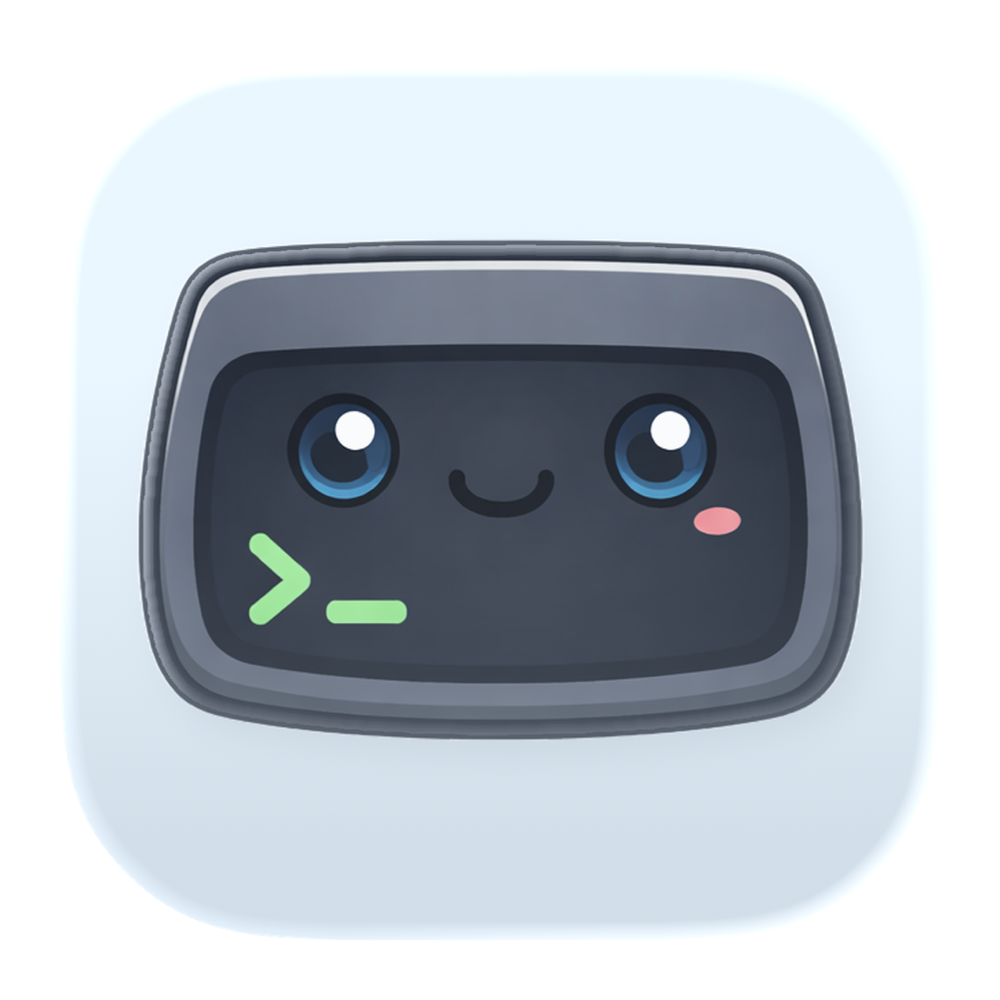

  
  <h1>Termy</h1>
  
A minimal terminal emulator built with <a href="https://gpui.rs">GPUI</a> and <a href="https://alacritty.org">alacritty_terminal</a>.

  

    <a href="https://termy.run/docs">Documentation</a> •
    <a href="https://github.com/lassejlv/termy/releases/latest">Download</a> •
    <a href="https://github.com/lassejlv/termy">GitHub</a>
  

## Download

[Download Termy](https://termy.run/#download) for your platform at termy.run

## License

MIT — see [LICENSE](LICENSE).
